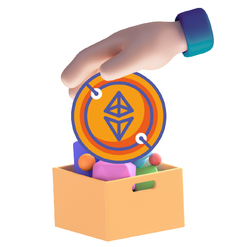

    

<h1 align="center">Altruize - Web3-Based NGO Donation Platform</h1>

Join the movement of giving back with our web3-based donation platform for NGOs and easy signup process for accepting donations.

[View Live Project 🖥](https://altruize.vercel.app/) • [Intro 🤘](#introduction) • [Challenges ⛰](#challenges-we-ran-into) • [Getting Started 🚀](/README.next.md) • [Team 💪](#meet-the-team)

## Introduction

A web3-based NGO donations app has several advantages over a web2-based app. Web3 technology, which is built on blockchain, enables secure and transparent transactions, with no need for intermediaries like banks or payment processors. This means that donors can have complete control over their donations, without worrying about fraud or misuse of funds.

Additionally, web3-based apps can offer smart contracts, which can automate the donation process and ensure that donations are distributed to the intended recipients. Web3 technology also enables decentralized applications (dApps), which can provide a more democratic and decentralized approach to decision-making within the NGO.

With a web3-based app, donors can have greater trust and confidence in the donation process and can be assured that their contributions are making a meaningful impact towards the NGO's mission.

## Challenges we ran into

Here are some challenges faced while building a blockchain-based NGO donation app:

Complexity: Building a blockchain-based NGO donation app requires a deep understanding of blockchain technology, which can be complex and challenging to implement.

Limited blockchain adoption: While blockchain technology has gained popularity in recent years, it is still not widely adopted, especially in developing countries. This can limit the potential user base of a blockchain-based NGO donation app.

Scalability: Blockchain technology is still in its early stages of development, and scalability can be a challenge. As the number of users on the app grows, the blockchain network may struggle to handle the increased demand, resulting in slower transaction times or higher fees.

User experience: Blockchain technology can be difficult for the average user to understand and use. A blockchain-based NGO donation app needs to provide a seamless and user-friendly experience for donors, which may require additional design and development efforts.

Security: While blockchain technology is known for its security features, it is not immune to hacks or vulnerabilities. Ensuring the security of the blockchain network and the app itself is critical to building trust with donors.

Regulation: The regulatory landscape around blockchain technology is still evolving, and building a blockchain-based NGO donation app requires navigating complex legal and regulatory frameworks.

Integration: A blockchain-based NGO donation app needs to integrate with existing payment systems and banking infrastructure to enable donors to easily transfer funds to the NGO. This can be a challenging task, especially if the app operates across multiple countries with different banking regulations.

Overall, building a blockchain-based NGO donation app requires a deep understanding of blockchain technology, user experience design, security, regulation, and integration with existing payment systems.

## Meet the team

<table align="center">
    <tr>
        <td align="center">
            
            <h3>Zeeshan Javed</h3>
            <table>
                <tr>
                    <td>
                        
                    </td>
                    <td>
                        
                    </td>
                    <td>
                        
                    </td>
                    <td>
                        
                    </td>
                </tr>
            </table>
        </td>
        <td align="center">
            
            <h3>Arnav Shukla</h3>
            <table>
                <tr>
                    <td>
                        
                    </td>
                    <td>
                        
                    </td>
                    <td>
                        
                    </td>
                    <td>
                        
                    </td>
                </tr>
            </table>
        </td>
        </tr>
        <tr>
        <td align="center">
            
            <h3>Kevin Paul</h3>
            <table>
                <tr>
                    <td>
                        
                    </td>
                    <td>
                        
                    </td>
                    <td>
                        
                    </td>
                    <td>
                        
                    </td>
                </tr>
            </table>
        </td>
        <td align="center">
            
            <h3>Kunal Keshan</h3>
            <table>
                <tr>
                    <td>
                        
                    </td>
                    <td>
                        
                    </td>
                    <td>
                        
                    </td>
                    <td>
                        
                    </td>
                </tr>
            </table>
        </td>
    </tr>
</table>